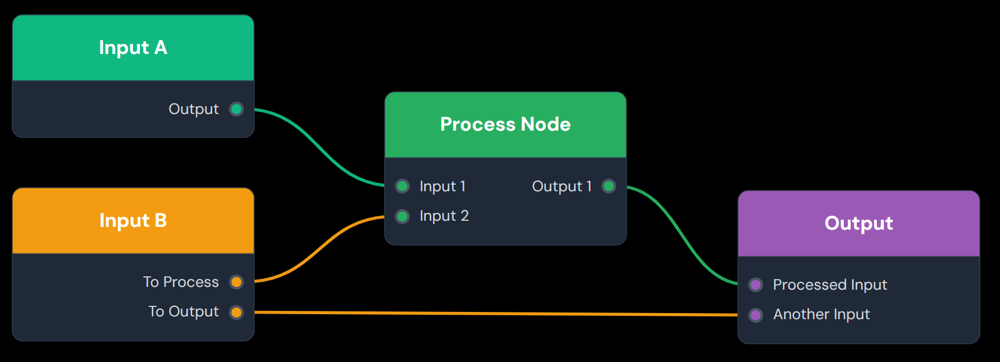
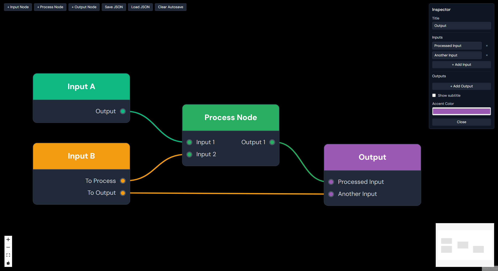

## NILOR Node Editor (React Flow)



A lightweight, themeable node-graph mockup for quickly building polished diagrams and slides. Built with Vite + React + TypeScript and React Flow.

### 1) Prerequisites

- Node.js 18+ (or 20+)
- npm (comes with Node)

### 2) Install & Run

```bash
npm install
npm run dev
```

Open the URL shown in the terminal (usually `http://localhost:5173`).

### 3) What you’ll see

- A black canvas with a few sample nodes
- A toolbar (top-left) with buttons to add new nodes
- A minimap and pan/zoom controls
- An Inspector (top-right) appears when you click a node



### 4) Basic usage

- Pan: Click-drag on the canvas
- Zoom: Mouse wheel / trackpad gesture
- Select node: Click the node body
- Move node: Drag a node by its body
- Connect nodes: Drag from a right (output) port to a left (input) port
- Delete a connection (wire): Double-click the wire, or select the wire and press Delete/Backspace

### 5) Adding nodes (toolbar)

- “+ Input Node”
  - Creates a node with only outputs (right side)
- “+ Process Node”
  - Creates a node with inputs (left) and outputs (right)
- “+ Output Node”
  - Creates a node with only inputs (left side)

Each new node gets a random accent color and a random position within the view.

### 6) Editing a node (Inspector)

Click a node to open the Inspector (top-right):

- Title: Free text
- Subtitle: Only shown for nodes that have one (e.g., the core demo node)
- Accent Color: Color input affecting the node header and default port colors
- Inputs section:
  - Rename any input label inline
  - Remove an input (×) — any connected wires to that port are also removed
  - “+ Add Input” to append a new input
- Outputs section:
  - Rename any output label inline
  - Remove an output (×) — any connected wires to that port are also removed
  - “+ Add Output” to append a new output

Changes are applied immediately to the selected node.

### 7) Ports and wires

- Ports are the colored circular handles along the left (inputs) and right (outputs) edges of the node body
- Wires are native React Flow bezier edges; no arrowheads for a clean look
- While dragging a connection, you must start from an output and finish on an input
